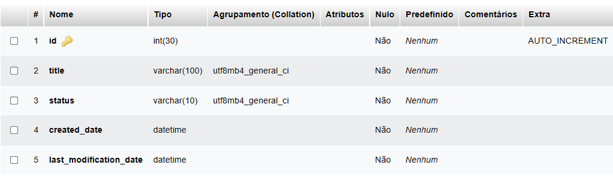

# To-do List Project

Projeto de estudo sobre a integração do Frontend com o Backend.

## [Frontend](./frontend/)

No frontend me desafiei a usar o JavaScript Vanilla, sem bibliotecas, frameworks, ou "cópia e cola".\
Assim ganhei muita noção de DOM (Document Object Model), funções assíncronas, `fetch` com a API e `localStorage`.

## [Backend](./backend/)

Este foi um dos meus primeiros contatos com o backend, onde comecei a aprender sobre estruturação de arquivos, rotas, server e databases.

### Getting Started with Express

**router.js**

    const express = require("express");
    const router = express.Router();

    router.use((_req, res, next) => 
    {
        res.header("Access-Control-Allow-Origin", "*");
        res.header("Access-Control-Allow-Headers", "*");
        res.header('Access-Control-Allow-Methods', 'GET, PUT, POST, DELETE');
        next();
    });

    router.get("/", (req, res) => res.status(200).json({Server: "Running"}));

    module.exports = router;

**app.js**

    const express = require("express");
    const router = require("./router");

    const app = express();

    app.use(express.json());
    app.use(router);

    module.exports = app;

**server.js**

    const app = require("./app");
    require("dotenv").config();

    const PORT = process.env.PORT || 3333;

    app.listen(PORT, () => console.log(`Server running on port ${PORT}`));

### Available Scripts

In the project directory, you can run:

    npm run dev

Runs the app in the development mode.\
Open http://localhost:3333 to view it in your browser.

### DataBase Connection

**.env**

**connection.js**

### Create DataBase on LocalHost using [Xampp](https://www.apachefriends.org/pt_br/index.html)

**Structure**

